# Conditional Statements
- [Conditional Statements](#conditional-statements)
	- [**1-FOR Loop**](#1-for-loop)
		- [**What is For Loop?**](#what-is-for-loop)
		- [**BASIC For Loop**](#basic-for-loop)
		- [**REVERSE with For Loop**](#reverse-with-for-loop)
		- [**CONTINUE with For Loop**](#continue-with-for-loop)
		- [**EXIT with For Loop**](#exit-with-for-loop)
		- [**GOTO with For Loop**](#goto-with-for-loop)
		- [**RETURN with For Loop**](#return-with-for-loop)
		- [**CURSOR with For Loop**](#cursor-with-for-loop)
	- [**2-WHILE Loop**](#2-while-loop)
		- [**What is While loop?**](#what-is-while-loop)
		- [**Bolean expression in while loop**](#bolean-expression-in-while-loop)
		- [**EXIT with While loop**](#exit-with-while-loop)
		- [**LABEL with While loop**](#label-with-while-loop)
		- [**EXPLICIT CURSOR with While loop**](#explicit-cursor-with-while-loop)
	- [**3-LOOP**](#3-loop)
		- [**What is Loop that use LOOP?**](#what-is-loop-that-use-loop)
		- [**IF-EXIT in Loop**](#if-exit-in-loop)
		- [**EXIT WHEN in Loop**](#exit-when-in-loop)
	- [**4-IF Statements**](#4-if-statements)
		- [**What is IF statements?**](#what-is-if-statements)
		- [**IF - a single condition**](#if---a-single-condition)
		- [**IF ELSE - an alternative condition**](#if-else---an-alternative-condition)
		- [**IF ELSIF ELSE - multiple alternatives condition**](#if-elsif-else---multiple-alternatives-condition)
		- [**Example:**](#example)


## **1-FOR Loop**
### **What is For Loop?**
For loops in PL/SQL iterate through a sequence of integers or through rows of a query result set, making them essential for procedural programming. 

- The loop index can iterate in ascending or descending order using the REVERSE keyword.
- Control flow statements like CONTINUE, EXIT, GOTO, and RETURN allow to manage loop execution.
- Using for loop with CURSOR to process each row from the query result in cursor.

**Syntax:**
```sql
FOR index IN [REVERSE] lower_bound..upper_bound LOOP
   -- statements to execute
END LOOP;
```

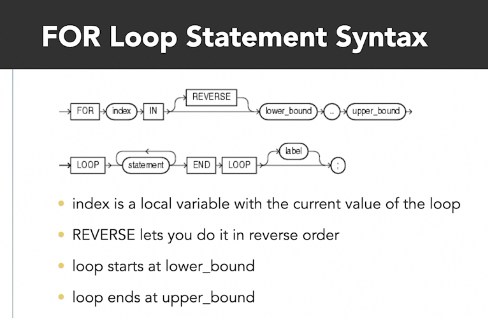

### **BASIC For Loop**
```sql
DECLARE 
	start_val NUMBER := 1;
	end_val  NUMBER := 5;
	cal_sqrt DECIMAL(3,2);

BEGIN
	FOR i IN start_val..end_val LOOP
		cal_sqrt := sqrt(i);
		dbms_output.put_line('Square root of ' || i || ' is: ' || cal_sqrt);
		
	end LOOP;
	
END;

-- ouput
Square root of 1 is: 1
Square root of 2 is: 1.41
Square root of 3 is: 1.73
Square root of 4 is: 2
Square root of 5 is: 2.24

```

### **REVERSE with For Loop** 
Using reverse to start index loop from upper bond value.

```sql
DECLARE 
	start_val NUMBER := 1;
	end_val  NUMBER := 5;
	cal_sqrt DECIMAL(3,2);

BEGIN
	FOR i IN REVERSE start_val..end_val LOOP
		cal_sqrt := sqrt(i);
		dbms_output.put_line('Square root of ' || i || ' is: ' || cal_sqrt);
		
	end LOOP;
	
END;

-- output
Square root of 5 is: 2.24
Square root of 4 is: 2
Square root of 3 is: 1.73
Square root of 2 is: 1.41
Square root of 1 is: 1
```

### **CONTINUE with For Loop**
Using continue with for loop to skip the rest of loop and process the next index value.

```sql
DECLARE 
	start_val NUMBER := 1;
	end_val  NUMBER := 5;
	cal_sqrt DECIMAL(3,2);

BEGIN
	FOR i IN start_val..end_val LOOP
		cal_sqrt := sqrt(i);
		IF cal_sqrt = 2 THEN
			CONTINUE;
		END IF;

		dbms_output.put_line('Square root of ' || i || ' is: ' || cal_sqrt);
		
	end LOOP;
		
	dbms_output.put_line('-----------');
END;

-- output
Square root of 1 is: 1
Square root of 2 is: 1.41
Square root of 3 is: 1.73
Square root of 5 is: 2.24
-----------
```

### **EXIT with For Loop**

Using exit in for loop to exit loop before interating through all index values.

```sql
DECLARE 
	start_val NUMBER := 1;
	end_val  NUMBER := 5;
	cal_sqrt DECIMAL(3,2);

BEGIN
	FOR i IN start_val..end_val LOOP
		cal_sqrt := sqrt(i);
		IF cal_sqrt = 2 THEN
			EXIT;
		END IF;

		dbms_output.put_line('Square root of ' || i || ' is: ' || cal_sqrt);
		
	end LOOP;
		
	dbms_output.put_line('-----------');
END;

-- ouput
Square root of 1 is: 1
Square root of 2 is: 1.41
Square root of 3 is: 1.73
-----------
```

### **GOTO with For Loop**

Using Goto in for loop to skip to a label outside of the loop but in the same block.

```sql
DECLARE 
	start_val NUMBER := 1;
	end_val  NUMBER := 5;
	cal_sqrt DECIMAL(3,2);

BEGIN
	FOR i IN start_val..end_val LOOP
		cal_sqrt := sqrt(i);
		IF cal_sqrt = 2 THEN
			GOTO skip_end;
		END IF;

		dbms_output.put_line('Square root of ' || i || ' is: ' || cal_sqrt);
		
	end LOOP;
	<<skip_end>> null;
	dbms_output.put_line('Done looping');
END;

--output
Square root of 1 is: 1
Square root of 2 is: 1.41
Square root of 3 is: 1.73
Done looping
-----------
```

### **RETURN with For Loop**

Using Return in for loop to exit loop and enclosing block.

```sql
DECLARE 
	start_val NUMBER := 1;
	end_val  NUMBER := 5;
	cal_sqrt DECIMAL(3,2);

BEGIN
	FOR i IN start_val..end_val LOOP
		cal_sqrt := sqrt(i);
		IF cal_sqrt = 2 THEN
			RETURN;
		END IF;

		dbms_output.put_line('Square root of ' || i || ' is: ' || cal_sqrt);
		
	end LOOP;
	dbms_output.put_line('Done looping');
END;


-- output: REUTRN exit immediately the block, and don't run code outside the loop, as in example, didn't output the line "Done looping"
Square root of 1 is: 1
Square root of 2 is: 1.41
Square root of 3 is: 1.73

```

### **CURSOR with For Loop**

For loop process through resulf set of a query in cursor.

```sql
DECLARE 
	emp_firstname employees.first_name%TYPE;
	emp_dept employees.department_id%TYPE; 

BEGIN
	FOR name IN (SELECT first_name, department_id FROM employees) LOOP	
		
		emp_dept := name.department_id;
		emp_firstname := name.first_name;
		
		IF emp_firstname = 'Adam' THEN
		
			dbms_output.put_line('Exmployees firstname is : ' || emp_firstname || ' , Dept id: ' || emp_dept);
		
		END IF;
		
	END LOOP;
	
END;

-- output
Exmployees firstname is : Adam , Dept id: 50
```

---

## **2-WHILE Loop**

### **What is While loop?**

While loop is used to repeatly execute block of codes as long as the a specific bolean condition is true, by checking the condition(`run zero or more times`) at the start of each interations.

- Use `EXIT` statements inside the loop to leave the loop based on additional conditions.
- `LABEL` can be used to control flow and in nested loop is allowing to exit outer loops from the inner loops.
- While loops can work with `EXPLICIT CURSOR` to process query result row by row.

**Syntax:**
```sql
<<label>> 
WHILE condition LOOP
   -- statements to execute
END LOOP <<label>>;
```

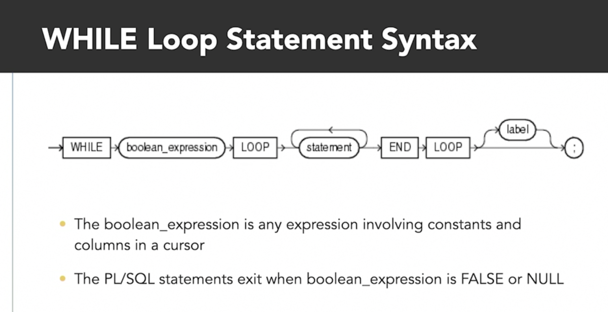

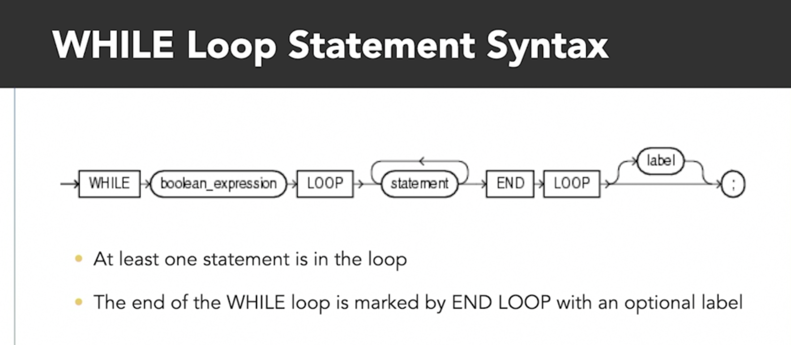

**While loop explain**

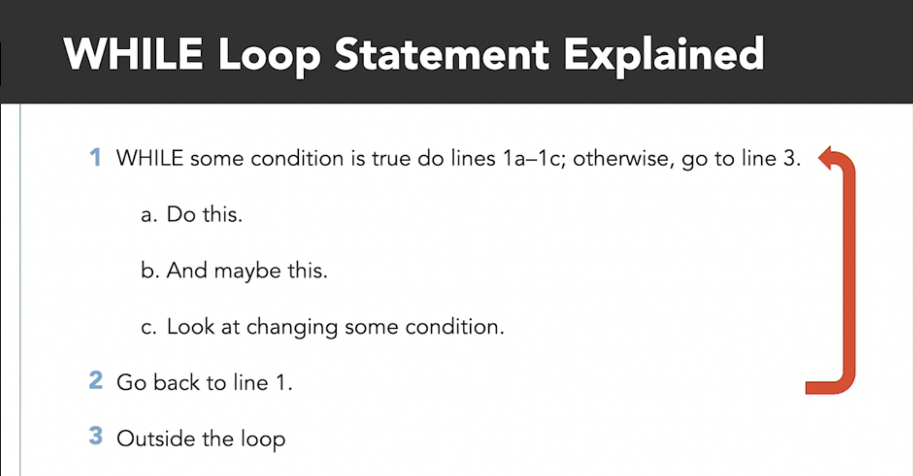

### **Bolean expression in while loop**

```sql
DECLARE 
	count_num NUMBER := 1;
BEGIN
	WHILE count_num < 5 LOOP 
		dbms_output.put_line('Loop number is: ' || count_num || ' , squared is: ' || count_num**2);
		count_num := count_num +1;
	END LOOP;
END;

-- output
Loop number is: 1 , squared is: 1
Loop number is: 2 , squared is: 4
Loop number is: 3 , squared is: 9
Loop number is: 4 , squared is: 16
```

### **EXIT with While loop**
```sql
DECLARE 
	count_num NUMBER := 1;
BEGIN
	WHILE count_num < 5 LOOP 
		dbms_output.put_line('Loop number is: ' || count_num || ' , squared is: ' || count_num**2);
		count_num := count_num +1;

		IF mod(count_num, 2) = 0 THEN 
			EXIT;
		END IF;
	END LOOP;
		dbms_output.put_line('After loop exists');
END;
-- output
Loop number is: 1 , squared is: 1
After loop exists
```

### **LABEL with While loop**

```sql
DECLARE 
	int_sum NUMBER := 0;
	in_loop NUMBER :=0;
	out_loop NUMBER :=0;
BEGIN
	<<outer_loop>>
	WHILE out_loop < 10 LOOP 	
		out_loop := out_loop + 1;	

		<<inner_loop>>
		WHILE in_loop < 50 LOOP 

			IF int_sum > 50 THEN 
				EXIT outer_loop;
			END IF;
		
			int_sum := int_sum + in_loop*out_loop;
			in_loop := in_loop + 1;
		
		END LOOP inner_loop;
		
	END LOOP outer_loop;
		
	dbms_output.put_line('Sum = ' || int_sum);
END;

-- output 
Sum = 55
```

### **EXPLICIT CURSOR with While loop**
```sql
DECLARE
    -- Declare an explicit cursor
    CURSOR emp_cursor IS
        SELECT employee_id, last_name
        FROM employees
        WHERE last_name = 'Grant'
        ORDER BY employee_id;

    -- Variables that receive the fetched values
    v_employee_id employees.employee_id%TYPE;
    v_last_name   employees.last_name%TYPE;
BEGIN
    -- 1. Open the cursor
    OPEN emp_cursor;
	

    -- 2. Fetch the first row
    FETCH emp_cursor
    INTO v_employee_id, v_last_name;

    -- 3. Continue while the previous FETCH found a row
    WHILE emp_cursor%FOUND LOOP
        DBMS_OUTPUT.PUT_LINE(
            v_employee_id || ' - ' || v_last_name
        );

        -- 4. Fetch the next row
        FETCH emp_cursor
        INTO v_employee_id, v_last_name;
    END LOOP;
        
    DBMS_OUTPUT.PUT_LINE(
           'Cursor found: ' || emp_cursor%rowcount
        );
    
    -- 5. Close the cursor
    CLOSE emp_cursor;
END;

-- output
178 - Grant
199 - Grant
Cursor found: 2
```

---

## **3-LOOP**

### **What is Loop that use LOOP?**
- A PL/SQL loop with the LOOP keyword run a block of PL/SQL
code and terminates with END LOOP.
- The simplest loop structure in PL/SQL
- Always `run at least one`
- Evaluates a condition inside the body of code block to exit the loop, then need to have IF statment to know when to end the loop.
- Loop is terminated with `EXIT, EXIT WHEN, and GOTO`.
- Execution order of code inside loop can be alterd by GOTO and CONTINUE.
  
**Syntax:**

```sql
<<label>>
LOOP
	--statements
END LOOP <<label>>;
```

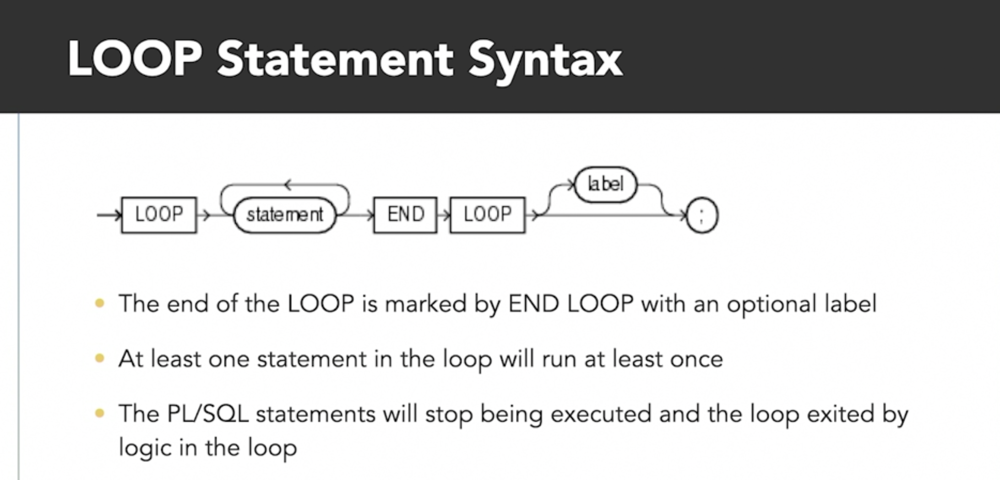

**Loop explain:**

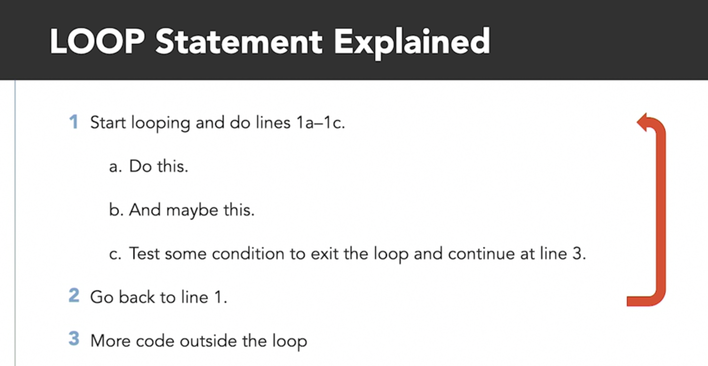

**Loop exit conditions:**

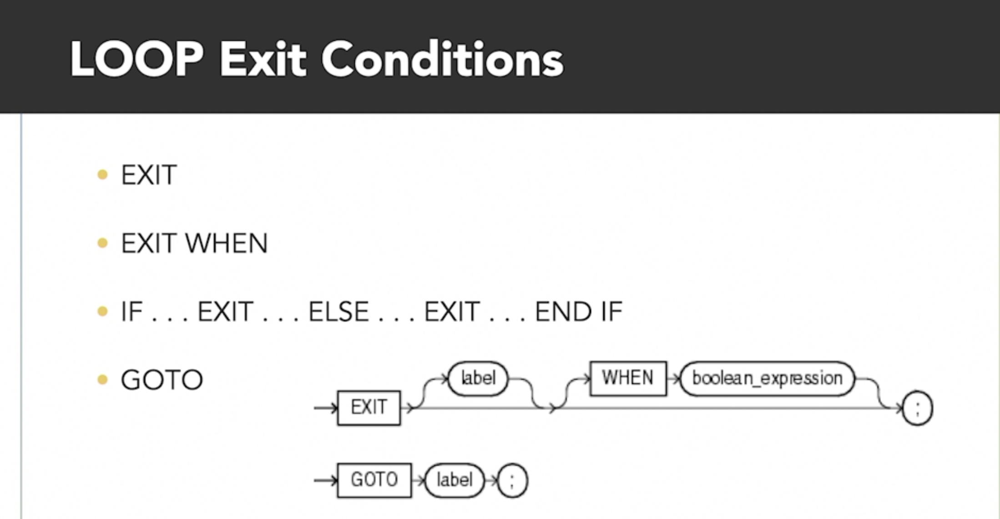

### **IF-EXIT in Loop**

```sql
DECLARE 
	count_num NUMBER := 1;
BEGIN
	LOOP
		IF count_num = 5 THEN 
			EXIT;
		END IF;
		dbms_output.put_line('Loop count is: ' || count_num || ' , squared is: ' || count_num**2);
		count_num := count_num +1;
	END LOOP;

END;
 
-- output
Loop count is: 1 , squared is: 1
Loop count is: 2 , squared is: 4
Loop count is: 3 , squared is: 9
Loop count is: 4 , squared is: 16

```

### **EXIT WHEN in Loop**

```sql
DECLARE 
	count_num NUMBER := 1;
BEGIN
	LOOP
		EXIT WHEN count_num = 5;
		dbms_output.put_line('Loop count is: ' || count_num || ' , squared is: ' || count_num**2);
		count_num := count_num +1;
	END LOOP;
	
	dbms_output.put_line('Done looping');
END;

-- output
Loop count is: 1 , squared is: 1
Loop count is: 2 , squared is: 4
Loop count is: 3 , squared is: 9
Loop count is: 4 , squared is: 16
Done looping
```

---

## **4-IF Statements**

### **What is IF statements?**
- The IF statement controls program flow by executing code blocks based on boolean conditions/expressions(TRUE/FALES).
- PL/SQL supports IF, ELSIF, and ELSE branches to handle multiple alternative conditions, but only one branch executes.
- Every IF statement starts with IF and ends with END IF, with boolean expressions determining which code runs.

**Syntax:**

```sql
-- IF
IF bolean_expression THEN
	-- statements;
END IF;

-- IF ELSE
IF bolean_expression THEN
	-- statements;
 ELSE 
	-- statements;
END IF;

-- IF ELSEIF
IF bolean_expression_1 THEN
	-- statements;
 ELSIF bolean_expression_2 THEN
	-- statements;
 ELSE 
	-- statements;
END IF;
```


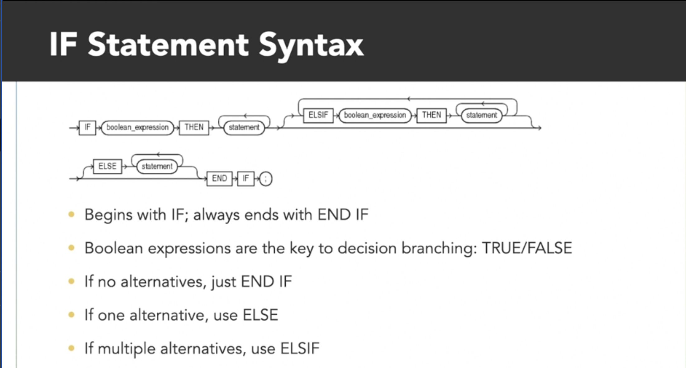

**If else explaintion:**

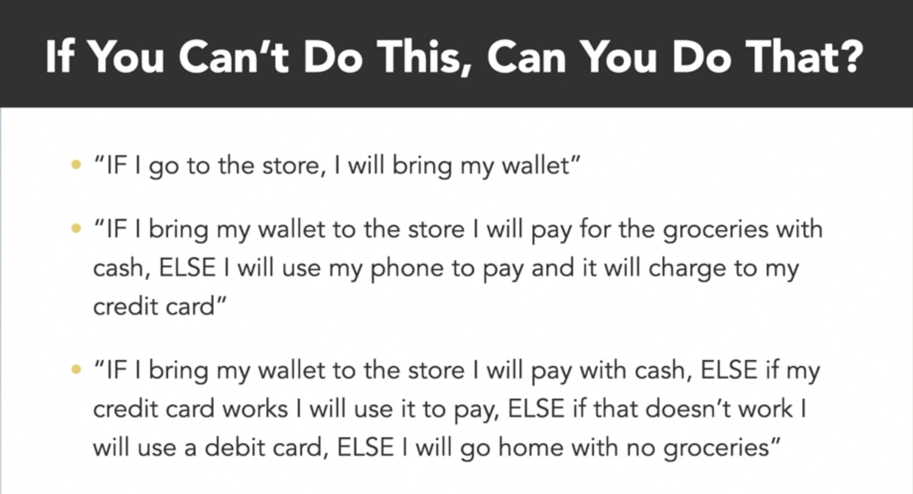

### **IF - a single condition**

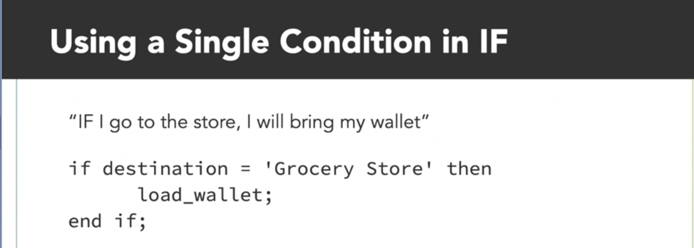

### **IF ELSE - an alternative condition**

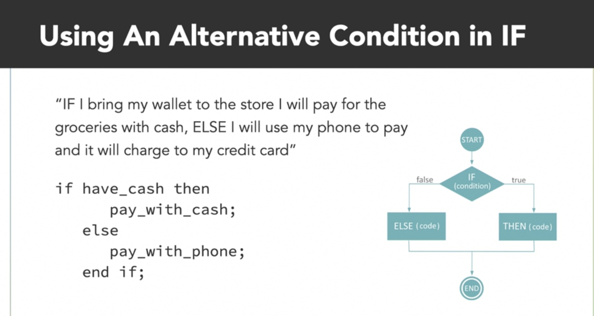

### **IF ELSIF ELSE - multiple alternatives condition**

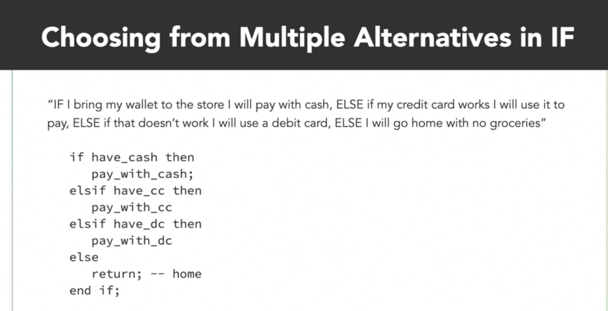

### **Example:**
```sql
DECLARE 
	day_of_work varchar2(50);

BEGIN
	SELECT to_char(sysdate, 'fmDay') INTO day_of_work FROM dual;
	
	IF day_of_work = 'Sunday' THEN 
		dbms_output.put_line('Weekend break day.');
	ELSIF day_of_work = 'Saturday' THEN 
		dbms_output.put_line('Weekend work day.');
	ELSE 
		dbms_output.put_line('Work day.');
	END IF;
END;
```