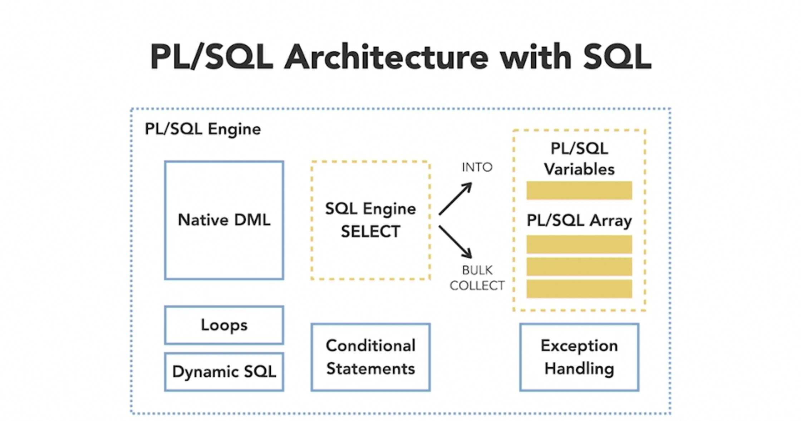
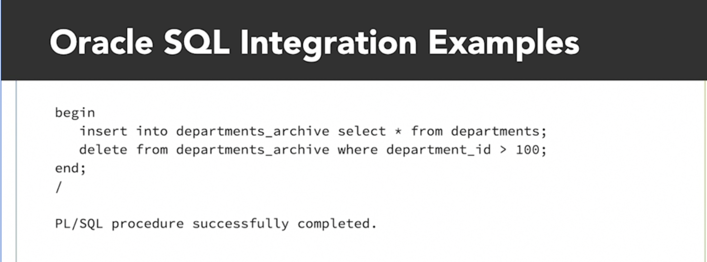
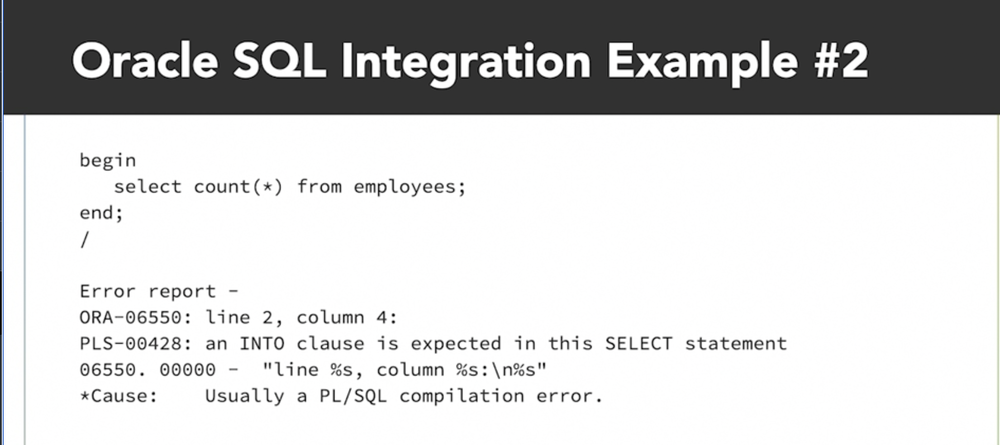
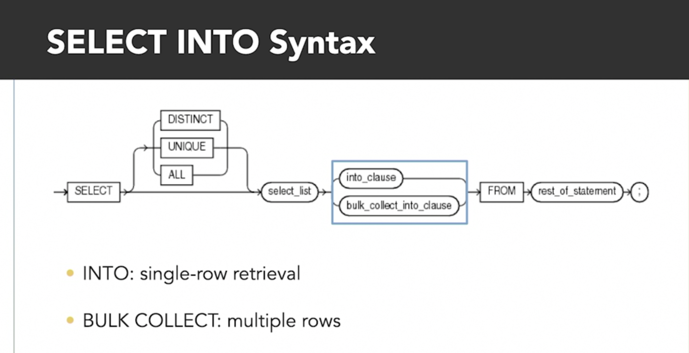

# **Using SQL Select Statements in PL/SQL**

- [**Using SQL Select Statements in PL/SQL**](#using-sql-select-statements-in-plsql)
  - [1-Using SELECT INTO and SQL%](#1-using-select-into-and-sql)
    - [Key features of PL/SQL with Oracle SQL](#key-features-of-plsql-with-oracle-sql)
    - [PL/SQL Architecture with SQL](#plsql-architecture-with-sql)
    - [DML in PL/SQL](#dml-in-plsql)
    - [SELECT INTO](#select-into)
    - [DML Built-in Variables](#dml-built-in-variables)
  - [2-Static and Dynamic SQL Statements in PL/SQL](#2-static-and-dynamic-sql-statements-in-plsql)
    - [Using `Static SQL` statements](#using-static-sql-statements)
    - [Using `Dynamic SQL` in Oracle PL/SQL](#using-dynamic-sql-in-oracle-plsql)
      - [Execute DDL Dynamically](#execute-ddl-dynamically)
      - [Dynamic DML with Bind Variables](#dynamic-dml-with-bind-variables)
      - [Dynamic Single-Row Query](#dynamic-single-row-query)
  - [Static SQL Versus Dynamic SQL](#static-sql-versus-dynamic-sql)


## 1-Using SELECT INTO and SQL%

### Key features of PL/SQL with Oracle SQL

- PL/SQL intergrated with Oracle SQL feature such as `cursor`, `for loop`, `if-then`, and so on.
- Using `select statements` in PL/SQL.
- Using `DML(Data Manipulation Language)`: insert, update, delete, merge, and so on.
- Can `run DML` statements `without changing syntax` inside PL/SQL
- Process `select results` in useful ways like put into PL/SQL variable using `INTO` for single row or `BULK COLLECT INTO` for multiple rows.
- Use `DML built-in variable` such as: SQL%ROWCOUNT, SQL%NOTFOUND, SQL%FOUND, SQL%ROWCOUNT, % vairable scope, and so on.  

---

### PL/SQL Architecture with SQL



### DML in PL/SQL
- Intergration DML statements in PL/SQL:



- Intergration DML statements in PL/SQL which is not very useful, because there is no something to do with select results:



---

### SELECT INTO



- Using `select into` for returning a signle rows.

Example:
```sql
DECLARE
    -- Variable datatype matches the LAST_NAME column
    v_last_name employees.last_name%TYPE;
BEGIN
    -- SELECT INTO retrieves exactly one row
    SELECT last_name
    INTO v_last_name          -- Store the selected value in the variable
    FROM employees
    WHERE employee_id = 100;  -- Use a unique condition to return one row

    DBMS_OUTPUT.PUT_LINE(
        'Employee: ' || v_last_name
    );
END;
/

-- output:
Employee: King

```
- Using `bulk collect into` for returning multples rows.

Example:
```sql
DECLARE
    -- Step 1: Define a collection type
    TYPE name_list IS
        TABLE OF employees.last_name%TYPE;

    -- Step 2: Declare a collection variable
    v_last_names name_list;
BEGIN
    -- Step 3: Store multiple query results in the collection
    SELECT last_name
    BULK COLLECT INTO v_last_names
    FROM employees
    WHERE department_id = 50;

    -- Step 4: Access the collection elements
    FOR i IN 1 .. v_last_names.COUNT LOOP
        DBMS_OUTPUT.PUT_LINE(v_last_names(i));
    END LOOP;
    DBMS_OUTPUT.PUT_LINE('Total employees last name found: ' || v_last_names.COUNT);
END;
/
-- output:
Employees 1 last_name : Grant
Employees 2 last_name : Weiss
Employees 3 last_name : Fripp
.
.
.
Employees 44 last_name : Feeney
Employees 45 last_name : OConnell
Total employees last name found: 45
```

---

### DML Built-in Variables

- `SQL%ROWCOUNT`: show number of affected rows by the DML.
- `SQL%NOTFOUND`: show bolean value(TRUE/FALSE) of rows that met the where clause were not found.
- `SQL%FOUND`: show bolean value(TRUE/FALSE) of rows were found that met the where clause.
- `% variable scope`: always reflect the status of the last SQL statement run, but if want to keep their values for later, need to store them in declared variables.

Example:
```sql
BEGIN
    -- Update the salary of employees in department 10000
    UPDATE employees
    SET salary = 20000
    WHERE department_id = 10000;

    -- SQL%FOUND returns TRUE when at least one row was updated
    IF SQL%FOUND THEN

        -- SQL%ROWCOUNT returns the total number of rows updated
        DBMS_OUTPUT.PUT_LINE(
            'Total employees updated: ' || SQL%ROWCOUNT
        );

    -- SQL%NOTFOUND returns TRUE when no rows were updated
    ELSIF SQL%NOTFOUND THEN
        DBMS_OUTPUT.PUT_LINE(
            'No employees were updated.'
        );
    END IF;

    -- Undo the update after testing to preserve the original data
    ROLLBACK;
END;
/

-- output: 
No employees were updated.
```

---

## 2-Static and Dynamic SQL Statements in PL/SQL

### Using `Static SQL` statements 
3 categories of SQL statements in PL/SQL:
- `SELECT statements` with the `INTO` keyword
- `DML statements` (INSERT, DELETE, UPDATE, MERGE)
- `Trasaction Control statements` (Commit, Rollback, Savepoint, Set Transaction, Lock table)

Example:

```sql
-- Using SELECT INTO statements
DECLARE
    total_emp NUMBER;
BEGIN
    SELECT
        COUNT(*)
    INTO total_emp
    FROM
        employees;

    dbms_output.put_line('total employees is: ' || total_emp);
END;
/

-- Using DML statements
BEGIN
    INSERT INTO employees_bk
        SELECT
            *
        FROM
            employees;

    dbms_output.put_line('row affected is : ' || SQL%rowcount);
END;
/

-- Using Transaction control, COMMIT or ROLLBACK
BEGIN
    INSERT INTO employees_bk
        SELECT
            *
        FROM
            employees;

    COMMIT;
END;
/

-- Using Sequences outside of tables
-- Create a sequence named my_sequence
CREATE SEQUENCE my_sequence
  START WITH 1
  INCREMENT BY 1
  NOCACHE
  NOCYCLE;

-- PL/SQL block to use the sequence
DECLARE
  v_nextval NUMBER;
  v_currval NUMBER;
BEGIN
  -- Get the next value from the sequence
  v_nextval := my_sequence.NEXTVAL;
  -- Get the current value of the sequence
  v_currval := my_sequence.CURRVAL;

  -- Display the values
  DBMS_OUTPUT.PUT_LINE('Next sequence value: ' || v_nextval);
  DBMS_OUTPUT.PUT_LINE('Current sequence value: ' || v_currval);
END;
/
```

### Using `Dynamic SQL` in Oracle PL/SQL

Dynamic SQL means building a SQL statement as text at runtime and then executing it from PL/SQL.

It is useful when part of the SQL statement is unknown until execution time, such as:

- Table name
- Column name
- WHERE condition
- DDL statement
- Number or type of bind variables

#### Execute DDL Dynamically
Important: DDL normally performs an implicit commit in Oracle.
```sql
BEGIN
    -- Build and execute the CREATE TABLE statement at runtime
    EXECUTE IMMEDIATE '
        CREATE TABLE test_employee (
            employee_id NUMBER,
            employee_name VARCHAR2(100)
        )
    ';
END;
/
```

#### Dynamic DML with Bind Variables
Explanation
- :salary and :emp_id are bind placeholders.
- USING supplies their values in positional order.
- Bind variables improve security and SQL reuse.
- Values should normally be passed through USING, not joined directly into the SQL string
```sql
DECLARE
    v_employee_id employees.employee_id%TYPE := 100;
    v_new_salary  employees.salary%TYPE := 20000;
BEGIN
    EXECUTE IMMEDIATE
        'UPDATE employees
         SET salary = :salary
         WHERE employee_id = :emp_id'
    USING v_new_salary, v_employee_id;

    DBMS_OUTPUT.PUT_LINE(
        'Rows updated: ' || SQL%ROWCOUNT
    );

    ROLLBACK;
END;
/
-- output:
Rows updated: 1
```

#### Dynamic Single-Row Query
```sql
DECLARE
    v_employee_id employees.employee_id%TYPE := 100;
    v_last_name   employees.last_name%TYPE;
BEGIN
    EXECUTE IMMEDIATE
        'SELECT last_name
         FROM employees
         WHERE employee_id = :emp_id'
    INTO v_last_name
    USING v_employee_id;

    DBMS_OUTPUT.PUT_LINE(
        'Employee: ' || v_last_name
    );
END;
/
```

## Static SQL Versus Dynamic SQL

`Static SQL`: The SQL structure is known when the PL/SQL block is compiled.
```sql
DECLARE
    v_name employees.last_name%TYPE;
BEGIN
    -- The SQL structure is fixed
    SELECT last_name
    INTO v_name
    FROM employees
    WHERE employee_id = 100;

    DBMS_OUTPUT.PUT_LINE(v_name);
END;
/
```

`Dynamic SQL`: The SQL statement is stored as text and processed at runtime.
```sql
DECLARE
    v_name employees.last_name%TYPE;
    v_sql  VARCHAR2(200);
BEGIN
    -- Store the SQL statement as text
    v_sql :=
        'SELECT last_name
         FROM employees
         WHERE employee_id = :id';

    -- Execute the SQL text
    EXECUTE IMMEDIATE v_sql
        INTO v_name
        USING 100;

    DBMS_OUTPUT.PUT_LINE(v_name);
END;
/

```